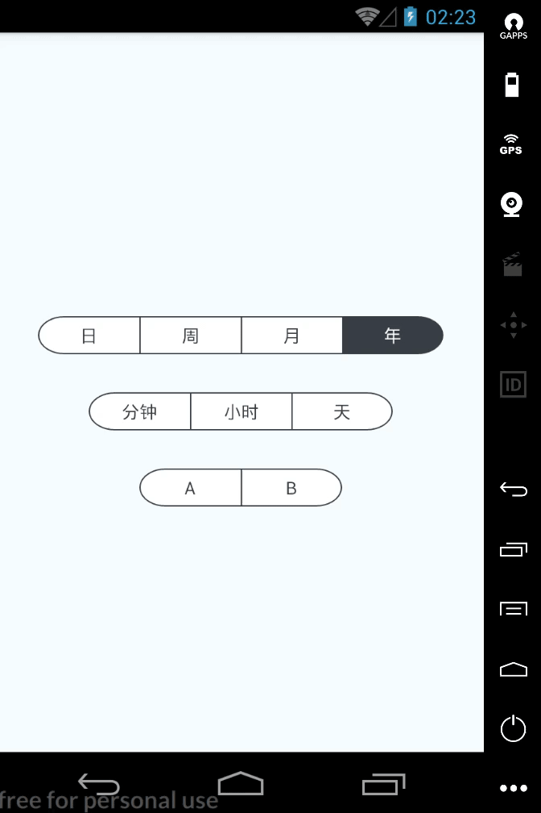

# react-native-segmented-tabs(for Android/iOS) 🚀
[]()
[](https://www.npmjs.com/package/react-native-segmented-tabs)
[](https://www.npmjs.com/package/react-native-segmented-tabs)

A react native component with the same concept of react native's SegmantedControlIOS, Primarily built to support both IOS and Android. 💡

## ScreenShots


## Install

```shell
npm install react-native-segmented-tabs --save
```

## Usage

### Import

```javascript
import SegmentedTabs from 'react-native-segmented-tabs';

class ConsumerComponent extends Component {

  constructor (props) {
    super(props);
    this.state = {
      selectIndex: 0
    }
  }

  _selectTabs = (index) => {
    this.setState({
      selectIndex: index
    });
  }

  render() {
      return (
          <View>
            <SegmentedTabs
              wrapStyle={styles.wrap}
              selectIndex={this.state.selectIndex} 
              onPress={this._selectTabs} 
              items={['日','周','月','年']}/>
          </View>
      );
  }
}
```
## Props
 Name | Description | Default | Type
------|-------------|----------|-----------
selectIndex | index of tab item to be selected initially | 0 | number
Items | titles of tabs  | `['A', 'B', 'C']` | array
borderRadius | borderRadius of whole tab | 5 | number
wrapStyle | external styles can be passed to override the default styles of the segmentedTabs wrapper| base styles added in SegmentedControlTab.js  | object(styles)
onPress | call-back function when a tab is selected | (item) => {} | function
tabHeight | the height of each of items | 30 | number
tabWidth | the width of each of items | 80 | number
tabBgColor | the backgroundColor of each of items | 'white' | string
tabActiveBgColor | the backgroundColor of active tab | '#383d45' | string
borderWidth | border width | 1 | number
borderColor | border color | '#383d45' | string
fontSize | font size | 16 | number
fontColor | font color | '#383d45' | string
tabActiveFontColor | font color of active item | 'white' | string

## Custom styling
  ```javascript
      <SegmentedTabs wrapStyle={styles.tabsContainerStyle}
          tabStyle={styles.tabStyle}
          tabTextStyle={styles.tabTextStyle}
          tabHeight={30}
          tabWidth = {100}
          ...
          selectIndex={this.state.selectIndex} 
          onPress={this._selectTabs} />

      const styles = StyleSheet.create({
          tabsContainerStyle: {
            //custom styles
          }
      })

  ```

## License

*MIT*

